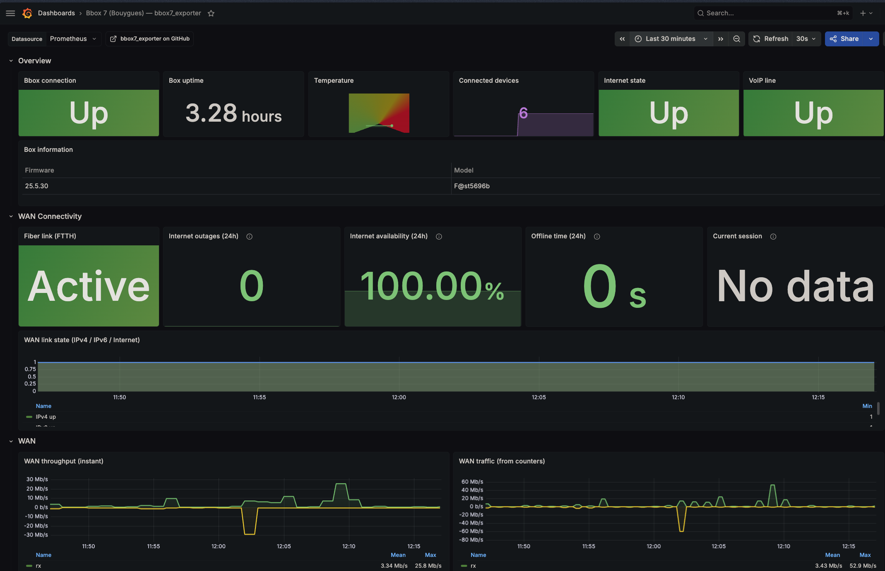

# bbox7_exporter

[Prometheus](https://prometheus.io/) exporter dedicated to the **Bbox Bouygues Telecom Wi‑Fi 7** (model **F@st5696b**).

```sh
make build        # or: GOTOOLCHAIN=go1.23.4 go build -o bbox7_exporter .
```

## Running

The password is the one of the box admin interface.

```sh
export BBOX_EXPORTER_PASSWORD='your_password'
./bbox7_exporter
```

Options (all overridable via environment variable):`

| Flag | Env | Default |
|------|-----|---------|
| `--endpoint` | `BBOX_EXPORTER_ENDPOINT` | `https://mabbox.bytel.fr` |
| `--password` | `BBOX_EXPORTER_PASSWORD` | _(empty)_ |
| `--resolve` | `BBOX_EXPORTER_RESOLVE` | _(empty)_ |
| `--web.listen-address` | `BBOX_EXPORTER_ADDR` | `:9311` |
| `--web.telemetry-path` | `BBOX_EXPORTER_METRICS_PATH` | `/metrics` |

Served endpoints: `/metrics`, `/-/healthy`, `/-/ready`.

## Prometheus

See [`prometheus.example.yml`](./prometheus.example.yml):

```yaml
scrape_configs:
  - job_name: bbox
    scrape_interval: 30s
    static_configs:
      - targets: ['localhost:9311']
```

## Grafana

A ready-to-use dashboard is provided in [`grafana-dashboard.json`](./grafana-dashboard.json); import it into Grafana to visualize the exposed metrics.



## Docker

A prebuilt multi-arch image (`linux/amd64`, `linux/arm64`) is published to the GitHub Container
Registry on every push:

```sh
docker run -e BBOX_EXPORTER_PASSWORD=... \
  -p 9311:9311 ghcr.io/almottier/bbox7_exporter:latest
```

Or with Docker Compose (see [`docker-compose.yml`](./docker-compose.yml)):

```sh
echo "BBOX_EXPORTER_PASSWORD=your_password" > .env
docker compose up -d
```

To build the image locally instead:

```sh
docker build -t bbox7_exporter .
```

## Exposed metrics (namespace `bbox`)

- **Status**: `bbox_up`, `bbox_scrape_endpoint_success{endpoint}`,
  `bbox_device_info{model_name,serial,firmware}`, `bbox_device_status`,
  `bbox_device_uptime_seconds`, `bbox_device_boots_total`, `bbox_device_fai_active{using}`.
- **System**: `bbox_cpu_time_seconds_total{mode}`, `bbox_processes{state}`,
  `bbox_processes_created_total`, `bbox_temperature_celsius`, `bbox_memory_kbytes{type}`.
- **WAN**: `bbox_wan_internet_state`, `bbox_wan_ip_up`, `bbox_wan_ip6_up`,
  `bbox_wan_bytes_total{direction}`, `bbox_wan_packets_total{direction}`,
  `bbox_wan_packets_errors_total`, `bbox_wan_packets_discards_total`,
  `bbox_wan_bandwidth_kbits{direction}`, `bbox_wan_max_bandwidth_kbits{direction}`,
  `bbox_wan_contractual_bandwidth_kbits{direction}`, `bbox_wan_occupation_percent{direction}`.
- **LAN**: `bbox_lan_bytes_total{direction}`, `bbox_lan_packets_total{direction}`,
  `bbox_lan_port_bytes_total{port,direction}`, `bbox_lan_port_packets_total{port,direction}`,
  `bbox_lan_port_bandwidth_kbits{port,direction}`.
- **Wi‑Fi (bands `2.4` / `5` / `6`)**: `bbox_wifi_bytes_total{band,direction}`,
  `bbox_wifi_packets_total`, `bbox_wifi_packets_errors_total`, `bbox_wifi_packets_discards_total`,
  `bbox_wifi_radio_enabled{band}`, `bbox_wifi_channel{band}`, `bbox_wifi_bandwidth_mhz{band}`,
  `bbox_wifi_standard_info{band,standard}`.
- **Devices**: `bbox_hosts_connected{link}`, `bbox_hosts_total`.
- **Services**: `bbox_service_status{service}`, `bbox_service_enabled{service}`
  (firewall, dhcp, nat, gamermode, hotspot, dyndns).
- **VoIP**: `bbox_voip_line_up{id,uri}`, `bbox_voip_line_callstate_info{id,callstate}`.
